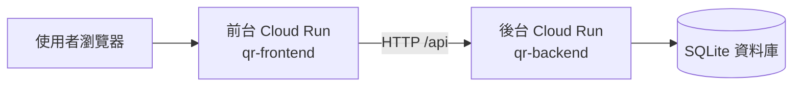
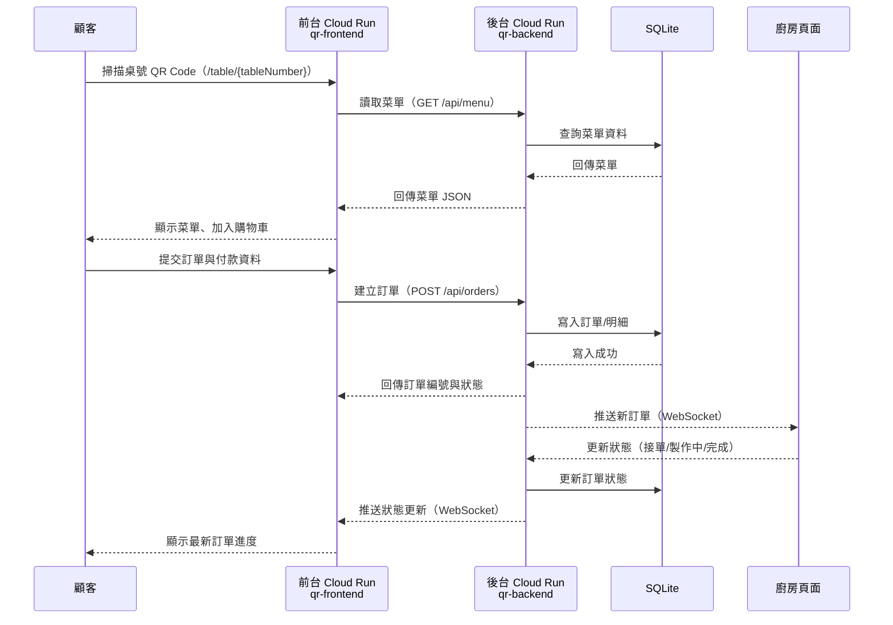
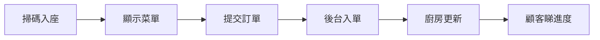

# 熊熊冰室 - QR Based Ordering System

## Production-Ready Restaurant Management System

A complete QR-based restaurant ordering system with real-time kitchen display, admin panel, and payment integration.

## 🏗️ Architecture

```
qr-ordering/
├── backend/
│   ├── app.py                 # FastAPI application (all-in-one)
│   ├── requirements.txt       # Python dependencies
│   ├── .env                  # Environment configuration
│   ├── .env.example          # Environment template
│   └── backend/static/       # QR codes storage
├── frontend/
│   ├── src/
│   │   ├── App.jsx           # Main app with routing
│   │   ├── main.jsx          # Entry point
│   │   ├── components/       # Reusable components
│   │   ├── pages/           # Page components
│   │   │   ├── CustomerPage.jsx    # Customer menu & ordering
│   │   │   ├── KitchenPage.jsx    # Kitchen display
│   │   │   ├── AdminPage.jsx      # Admin dashboard
│   │   │   ├── OrderStatusPage.jsx # Order tracking
│   │   │   └── admin/        # Admin sub-pages
│   │   ├── hooks/           # Custom hooks
│   │   │   └── useWebSocket.js    # WebSocket connection
│   │   ├── lib/            # Utilities
│   │   │   └── api.js      # API client
│   │   └── store/          # State management
│   │       └── store.js    # Zustand stores
│   ├── .env.example        # Environment template
│   └── package.json
└── README.md
```

## ✨ Features

### Customer Features
- 📱 QR-based menu access (table-specific URLs)
- 🍽️ Browse menu with categories and subcategories
- 🔍 Search and filter items (Veg/Non-Veg)
- 🛒 Add to cart with Half/Full selection
- 🥤 套餐可綁定配餐飲品（linked drink）
- 🧊 套餐配餐規則：熱飲 +$0、凍飲 +$3（不收飲品單點原價）
- 🧾 購物車/結帳會顯示「套餐價 + 附加費 = 實收」
- 💳 Razorpay payment integration
- 📊 Real-time order status tracking

### Kitchen Features
- 📋 Real-time order dashboard
- 🔔 New order notifications (sound + vibration)
- ⏱️ Order timer with urgency indicator
- ✅ Status management (Accept → Preparing → Ready → Complete)
- 💰 Payment status tracking

### Admin Features
- 📈 Dashboard with sales statistics
- 🍔 Menu management (CRUD operations)
- 📱 QR code generation for tables
- 📊 Sales reports and analytics
- 💳 Discount coupon management
- ⚙️ 定價設定頁（午市/晚市時段 + 套餐加減幅）

### Business Rules (Latest)
- 餐廳品牌名稱：**熊熊冰室**
- 套餐價格計算：`套餐價 + 配餐附加費`
	- 配熱飲：附加費 `+0`
	- 配凍飲：附加費 `+3`
	- 未配飲品：附加費 `+0`（按目前規則）
- 配餐飲品資料會寫入訂單明細：
	- `linked_drink_item_id`
	- `linked_drink_name`
	- `drink_temp` (`hot`/`iced`)
- 香港手機號碼驗證：接受 `8` 位數字，或 `+852` 前綴格式

## 🚀 Quick Start

### Prerequisites
- Python 3.11 to 3.13 (backend)
- Node.js 18+ (frontend)
- Git

### Backend Setup

```bash
cd qr-ordering/backend

# Create virtual environment
python -m venv .venv
# Windows
.venv\Scripts\activate
# Linux/Mac
source .venv/bin/activate

# Install dependencies
pip install -r requirements.txt

# Copy environment file
copy .env.example .env  # Windows
cp .env.example .env   # Linux/Mac

# Edit .env with your settings
# Note: Default Razorpay test keys are included for testing

# Start the server
uvicorn app:app --reload --host 0.0.0.0 --port 8000
```

### Frontend Setup

```bash
cd qr-ordering/frontend

# Install dependencies
npm install

# Copy environment file
copy .env.example .env  # Windows
cp .env.example .env   # Linux/Mac

# Start development server
npm run dev
```

### Access the Application

| Page | URL |
|------|-----|
| Customer Menu | http://localhost:5173/table/1 |
| Kitchen Display | http://localhost:5173/kitchen |
| Admin Panel | http://localhost:5173/admin |
| API Docs | http://localhost:8000/docs |

## 🔧 Environment Variables

### Backend (.env)

```env
# Razorpay Payment (Get from https://dashboard.razorpay.com)
RAZORPAY_KEY_ID=rzp_test_xxxxx
RAZORPAY_KEY_SECRET=xxxxxxxx

# Server Configuration
HOST=0.0.0.0
PORT=8000
FRONTEND_URL=http://localhost:5173

# Database
DATABASE_URL=sqlite+aiosqlite:///./delicacy_restaurant.db

# QR Configuration
MAX_TABLES=20  # Maximum number of tables for QR generation
```

### Frontend (.env)

```env
# API URL (auto-detected if not set)
VITE_API_URL=http://localhost:8000

# Razorpay Key
VITE_RAZORPAY_KEY_ID=rzp_test_xxxxx
```

## 💳 Payment Testing

Use these test credentials for Razorpay payments:

| Card Type | Card Number | Expiry | CVV |
|-----------|-------------|--------|-----|
| Success | 4111 1111 1111 1111 | Any future date | Any 3 digits |
| Failure | 4000 0000 0000 0002 | Any future date | Any 3 digits |

## 📱 QR Code System

### Generate QR Codes

1. Go to Admin Panel → QR Generator
2. Enter table number (1-{MAX_TABLES})
3. Download and print QR codes
4. Place on respective tables

### Customer Flow
1. Customer scans QR code
2. Redirects to `/table/{tableNumber}`
3. Browse menu and place order
4. Payment via Razorpay
5. Order sent to kitchen
6. Real-time status updates

## 🔌 WebSocket Events

The system uses WebSocket for real-time updates:

| Event | Direction | Description |
|-------|-----------|-------------|
| `new_order` | Server → Kitchen/Admin | New order placed |
| `order_updated` | Server → All | Order status changed |
| `payment_completed` | Server → All | Payment successful |

## 📊 API Endpoints

### Categories
- `GET /api/categories` - List categories
- `POST /api/categories` - Create category
- `PUT /api/categories/{id}` - Update category
- `DELETE /api/categories/{id}` - Delete category

### Menu
- `GET /api/menu` - List menu items (with filters)
- `POST /api/menu` - Create menu item
- `PUT /api/menu/{id}` - Update menu item
- `DELETE /api/menu/{id}` - Delete menu item
- `POST /api/menu/seed` - Seed default menu

### Orders
- `POST /api/orders` - Create order
- `GET /api/orders` - List orders
- `GET /api/orders/{id}` - Get order
- `PUT /api/orders/{id}/status` - Update status

### Kitchen
- `GET /api/kitchen/orders` - Kitchen orders
- `GET /api/kitchen/stats` - Kitchen statistics

### Payment
- `POST /api/payment/create-order` - Create payment
- `POST /api/payment/verify` - Verify payment

### Admin
- `GET /api/admin/stats` - Dashboard stats
- `GET /api/admin/sales` - Sales report
- `GET /api/admin/analytics` - Analytics data
- `GET /api/admin/export` - Export CSV
- `GET /api/admin/pricing-settings` - 取得套餐時段定價設定
- `PUT /api/admin/pricing-settings` - 更新套餐時段定價設定

## ☁️ Google Cloud Run（Learning Mode）

新增一鍵腳本：

- `deploy_gcp_learning.sh`：一鍵部署前台 + 後台到 Cloud Run
- `destroy_gcp_learning.sh`：一鍵刪除前台 + 後台服務並清理 images
- `destroy_gcp_learning.sh --dry-run`：只列出將刪除項目，不實際刪除
- `pause_gcp_learning.sh`：只停 Cloud Run 服務（保留映像）
- `resume_gcp_learning.sh`：由既有 latest 映像快速恢復服務

### Quick Commands

```bash
# 1) Deploy
./deploy_gcp_learning.sh

# 2) Cleanup
./destroy_gcp_learning.sh

# 3) Preview cleanup only
./destroy_gcp_learning.sh --dry-run

# 4) Pause only (keep images)
./pause_gcp_learning.sh

# 5) Resume fast (from existing images)
./resume_gcp_learning.sh
```

### 架構圖（Cloud Run）



### 請求流程圖（下單）



### 請求流程圖（簡報一行版）



> Learning mode 備註：目前使用 SQLite，Cloud Run instance 重啟後資料可能不持久；正式環境建議改用 Cloud SQL (PostgreSQL)。

### 📅 日曆式提醒（避免忘記清理）

- 每次 Demo 完成後（建議當日）：先執行 `./gcp_health_check.sh` 檢查現況
- 每週固定一天（例如每週五）：執行 `./destroy_gcp_learning.sh --dry-run` 預覽待刪除資源
- 若短期不再使用（例如 3-7 日內無 Demo）：執行 `./destroy_gcp_learning.sh` 釋放 Cloud Run 與映像成本
- 下次要再展示時：重新執行 `./deploy_gcp_learning.sh` 一鍵恢復環境

### 💸 最低成本模式（保留映像、只停服務）

適合情境：你想暫停每日計算成本，但希望下次快速恢復，不想重建映像。

- 步驟 1（建議先看）：`./gcp_health_check.sh`
- 步驟 2（只刪 Cloud Run，保留 Artifact Registry 映像）：

```bash
./pause_gcp_learning.sh
```

- 步驟 2b（只預覽，不實際停）：

```bash
./pause_gcp_learning.sh --dry-run
```

- 步驟 3（確認服務已停）：

```bash
gcloud run services list --region=asia-east1
```

- 恢復方式（不需重新 build，直接用現有 latest 映像部署）：

```bash
./resume_gcp_learning.sh
```

### QR Codes
- `GET /api/admin/generate-qr/{table}` - Generate QR
- `GET /api/admin/generate-all-qr` - Generate all QRs

## 🛡️ Security Considerations

For production deployment:

1. **CORS**: Update `FRONTEND_URL` to your production domain
2. **Authentication**: Add JWT authentication for admin endpoints
3. **Payment**: Use live Razorpay keys (not test keys)
4. **Database**: Consider PostgreSQL for production
5. **Rate Limiting**: Add rate limiting to APIs
6. **HTTPS**: Use HTTPS in production

## 📦 Production Deployment

### Backend
```bash
pip install gunicorn
gunicorn app:app -w 4 -k uvicorn.workers.UvicornWorker --bind 0.0.0.0:8000
```

### Frontend
```bash
npm run build
# Serve with nginx or static hosting
```

## 🐛 Troubleshooting

### Backend won't start
```bash
# Check if port 8000 is in use
netstat -ano | findstr :8000
# Kill process if needed
taskkill /PID <PID> /F
```

### Frontend won't start
```bash
# Clear node_modules and reinstall
rm -rf node_modules package-lock.json
npm install
```

### WebSocket connection failed
- Ensure backend is running on port 8000
- Check browser console for errors
- Verify CORS settings

### Database errors
```bash
# Delete existing database and restart
del delicacy_restaurant.db
uvicorn app:app --reload
```


## 🙏 Credits

Built with:
- [FastAPI](https://fastapi.tiangolo.com/) - Python web framework
- [React](https://reactjs.org/) - UI library
- [Tailwind CSS](https://tailwindcss.com/) - Styling
- [SQLite](https://www.sqlite.org/) - Database
- [Razorpay](https://razorpay.com/) - Payment gateway
- [Framer Motion](https://www.framer.com/motion/) - Animations
